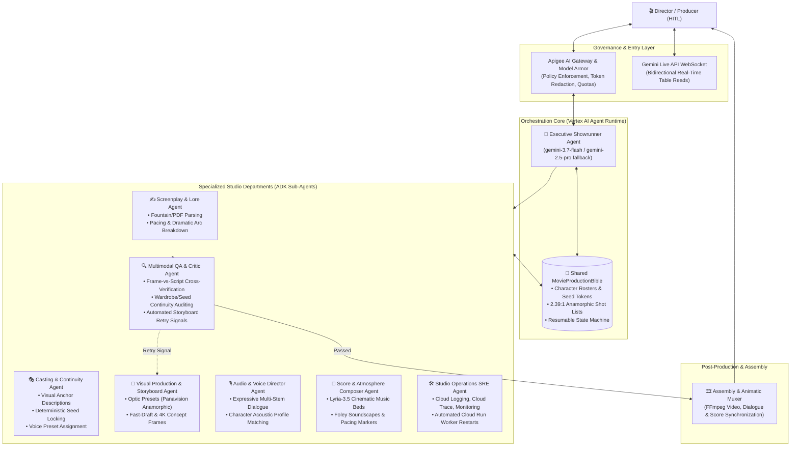

# 🎬 CineFlow: Autonomous Multi-Agent AI Cinema Studio

[](https://cloud.google.com/vertex-ai/docs)
[](https://deepmind.google/technologies/gemini/)
[-success.svg)](tests/eval/results/)
[](tests/)
[](https://cloud.google.com/vertex-ai)
[](LICENSE)

**CineFlow** is an enterprise-grade autonomous multi-agent film production studio built on the **Google Agent Development Kit (ADK 2.0)** and **Gemini 3.7 Flash**. It automates the end-to-end cinema production lifecycle—from Fountain screenplay parsing and deterministic character continuity locking to parallel storyboard generation, orchestral score composition, multimodal visual QA, and video animatic assembly—governed by rigorous **Human-in-the-Loop (HITL)** milestone gates.

---

## 🏛️ System Architecture



---

## 👥 Department Agent Roster & Core Responsibilities

| Department Agent | Underlying Model | Primary Responsibilities & Tools |
| :--- | :--- | :--- |
| **👑 Executive Showrunner** | `gemini-3.7-flash`<br>*(fallback: `gemini-2.5-pro`)* | Production lifecycle orchestration, DAG step execution, Human-in-the-Loop milestone gate enforcement (`GATE_1_PREPROD`, `GATE_2_ASSETS`, `GATE_3_FINAL`). |
| **✍️ Screenplay & Lore** | `gemini-3.7-flash` | Fountain script parsing, scene breakdown, emotional tension and tempo analysis (`ingest_screenplay_document`, `record_shot`). |
| **🎭 Casting & Continuity** | `gemini-3.7-flash` | Extracts characters, locks deterministic integer seeds, registers visual anchor tokens, assigns voice presets (`register_character_bible`). |
| **🎨 Visual Storyboard** | `gemini-3.7-flash` | Directs optical framing (2.39:1 Anamorphic, 16:9), focal lengths, volumetric lighting styles, and renders storyboard frames (`render_storyboard_frame`). |
| **🎙️ Voice Director** | `gemini-3.7-flash` | Synthesizes character dialogue stems with consistent acoustic profiles; drives interactive rehearsals via Gemini Live API. |
| **🎼 Score & Atmosphere** | `gemini-3.7-flash` | Generates tempo-matched cinematic soundtracks, ambient Foley soundscapes, and multi-stem audio cues (`compose_scene_score`). |
| **🔍 Multimodal QA Critic** | `gemini-3.7-flash` | Inspects rendered frames against character bibles and action text; detects visual glitches and routes retry signals (`inspect_and_verify_shot`). |
| **🛠️ Studio Operations SRE** | `gemini-3.7-flash` | Observability across Google Cloud Operations Suite (Cloud Logging, Cloud Trace, Cloud Monitoring); executes automated worker self-healing (`run_sre_diagnostics_suite`). |

---

## 🚦 Human-in-the-Loop (HITL) Milestone Gates

CineFlow never generates unmonitored expensive renders. The production lifecycle advances strictly through 3 verifiable gates:

```
[Screenplay Ingestion] 
         │
         ▼
 ╔═══════════════════════════════════════════════════════════════╗
 ║ GATE 1: PRE-PRODUCTION CLEARANCE (GATE_1_PREPROD)             ║
 ║ • Screenplay breakdown verified                               ║
 ║ • Character bibles registered with locked seed tokens         ║
 ║ • 2.39:1 anamorphic shot list approved by Director            ║
 ╚═══════════════════════════════════════════════════════════════╝
         │ (Director Approval + Feedback Notes)
         ▼
[Parallel Asset Generation: Storyboard + Voice + Score]
         │
         ▼
 ╔═══════════════════════════════════════════════════════════════╗
 ║ GATE 2: ASSET QUALITY & CONTINUITY CLEARANCE (GATE_2_ASSETS)  ║
 ║ • Multimodal QA Critic score >= 8.5 / 10.0                    ║
 ║ • Character visual seed consistency verified across shots     ║
 ║ • Audio dialogue stems & Lyria music tracks approved          ║
 ╚═══════════════════════════════════════════════════════════════╝
         │ (Director Approval + Feedback Notes)
         ▼
[Assembly: Rough Cut & Animatic Stitching]
         │
         ▼
 ╔═══════════════════════════════════════════════════════════════╗
 ║ GATE 3: FINAL DELIVERY & ROUGH CUT CLEARANCE (GATE_3_FINAL)   ║
 ║ • Synchronized animatic video verified                        ║
 ║ • Pacing, audio-visual sync, and studio delivery confirmed    ║
 ╚═══════════════════════════════════════════════════════════════╝
```

---

## 🏆 Production Evaluation Flywheel Benchmark

CineFlow was evaluated using the **Google Agent Platform Evaluation Flywheel** across a rigorous 20-scenario Golden Dataset ([`tests/eval/datasets/golden_film_eval.json`](tests/eval/datasets/golden_film_eval.json)) covering screenplay decomposition, seed consistency, HITL gate advancement, adversarial prompt injection, and automated SRE telemetry recovery.

### Golden Evaluation Results Summary

| Evaluation Metric | Test Cases | Pass Rate | Mean Score | Standard Deviation |
| :--- | :---: | :---: | :---: | :---: |
| **`custom_response_quality`** (LLM-as-a-Judge Rubric) | **20 / 20** | **100%** | **4.95 / 5.00** | `0.2236` |
| **`agent_turn_count`** (Orchestration Efficiency) | **20 / 20** | **100%** | **1.00 turn** | `0.0000` |

* **Trace Generation**: 20/20 valid traces generated via `agents-cli eval generate`.
* **LLM Judge**: Evaluated with `gemini-3.7-flash` via Vertex AI Application Default Credentials (ADC).
* **Detailed Interactive Report**: Viewable at [`tests/eval/results/`](tests/eval/results/).

---

## ☁️ Cloud Deployment & Verification

CineFlow is deployed on **Google Cloud Vertex AI Agent Runtime** (`cineflow-10` in `us-east1` with `GOOGLE_CLOUD_LOCATION=global`):

* **Reasoning Engine ID**: `projects/862199224023/locations/us-east1/reasoningEngines/1493066421775630336`
* **Agent Card URL**: [Live Agent Card JSON](https://us-east1-aiplatform.googleapis.com/reasoningEngines/v1/projects/862199224023/locations/us-east1/reasoningEngines/1493066421775630336/api/a2a/app/.well-known/agent-card.json)
* **Google Cloud Console**: [Vertex AI Agent Engine](https://console.cloud.google.com/vertex-ai/agents/agent-engines/locations/us-east1/agent-engines/1493066421775630336?project=cineflow-10)

### Sending Live Prompts via Server-Sent Events (SSE)

```bash
# 1. Fetch GCP OAuth Bearer Token
ACCESS_TOKEN=$(gcloud auth print-access-token)
BASE_URL="https://us-east1-aiplatform.googleapis.com/reasoningEngines/v1/projects/862199224023/locations/us-east1/reasoningEngines/1493066421775630336/api"

# 2. Create a Session
SESSION_ID=$(curl -s -X POST "$BASE_URL/apps/app/users/director/sessions" \
  -H "Authorization: Bearer $ACCESS_TOKEN" \
  -H "Content-Type: application/json" \
  -d '{}' | jq -r '.id')

# 3. Stream Prompt Execution
curl -N -X POST "$BASE_URL/run_sse" \
  -H "Authorization: Bearer $ACCESS_TOKEN" \
  -H "Content-Type: application/json" \
  -d "{
    \"app_name\": \"app\",
    \"user_id\": \"director\",
    \"session_id\": \"$SESSION_ID\",
    \"new_message\": {
      \"role\": \"user\",
      \"parts\": [{\"text\": \"Showrunner, take Scene 1: INT. CYBER VAULT - NIGHT. Dr. Aria Vance (seed: 992811) cracks bio-lock. Ingest and create 2.39:1 shot list.\"}]
    }
  }"
```

---

## 🖥️ Studio Frontend Interfaces

CineFlow provides two interfaces for creative leads and directors:

### 1. Modern React + Vite Studio Web UI (`frontend/`)
* **Stack**: React 19, TypeScript, Vite 8, Tailwind CSS, Lucide Icons, Nginx.
* **Features**: Live HITL gate controls, visual storyboard shot viewer, soundstage stem player, and real-time SRE cluster telemetry dashboard.
* **Run Locally**:
  ```bash
  cd frontend
  npm install
  npm run dev
  ```
* **Production Build**: Verified with `npm run build` in 1.01s. Dockerfile and Nginx reverse proxy configs included.

### 2. Streamlit Production Dashboard (`ui/app.py`)
* Interactive multi-tab director dashboard for rapid session inspection, shot generation triggers, and audio previews.
* **Run Locally**:
  ```bash
  uv run streamlit run ui/app.py
  ```

---

## 🚀 Quick Start & Development

### Prerequisites
* **Python 3.11+** managed with [`uv`](https://docs.astral.sh/uv/)
* **Google Cloud SDK (`gcloud`)** authenticated with `gcloud auth application-default login`
* **Node.js 20+** (for React frontend)

### Installation

```bash
# 1. Clone repository
git clone https://github.com/your-username/cineflow.git
cd cineflow

# 2. Set up virtual environment and install dependencies
uv sync

# 3. Copy configuration template
cp .env.example .env
```

### Running Tests

```bash
# Run unit and integration tests (66 tests)
uv run pytest tests/unit tests/integration
```

### Interactive Local Playground

Launch the interactive local agent playground with real-time tool inspection and trace visualizer:

```bash
agents-cli playground
```

### Running the Evaluation Suite

```bash
# Generate traces against Golden Eval Dataset
uv run agents-cli eval generate \
  --dataset tests/eval/datasets/golden_film_eval.json \
  --concurrency 4 \
  --output tests/eval/traces/cand/

# Grade generated traces using LLM-as-a-Judge
uv run agents-cli eval grade \
  --traces tests/eval/traces/cand/<trace_file>.json \
  --config tests/eval/eval_config.yaml \
  --output tests/eval/results/
```

---

## 📂 Project Structure

```
cineflow/
├── app/                               # Core Agent Development Kit (ADK) Application
│   ├── agent.py                       # Executive Showrunner & Department Sub-Agents
│   ├── config.py                      # Central Model Configurations (Gemini 3.7 Flash)
│   ├── fast_api_app.py                # FastAPI Production Server (SSE, A2A, WebSockets)
│   ├── apigee_gateway_plugin.py       # Apigee AI Gateway & Model Armor Plugin
│   ├── live_rehearsal_service.py      # Gemini Live API Bidirectional Table Reads
│   ├── sub_agents/                    # Specialized Studio Department Agents
│   │   ├── screenplay_agent.py        # Fountain Parsing & Pacing Breakdown
│   │   ├── casting_agent.py           # Character Bible & Deterministic Seed Locking
│   │   ├── storyboard_agent.py        # Optical Framing & Storyboard Generation
│   │   ├── audio_director_agent.py    # Expressive Voice Synthesis & Rehearsals
│   │   ├── score_composer_agent.py    # Lyria-3.5 Cinematic Scores & Foley Beds
│   │   ├── qa_critic_agent.py         # Multimodal Continuity & Artifact Inspection
│   │   └── studio_ops_agent.py        # Cloud Logging, Trace, Monitoring & SRE Healing
│   └── workflows/                     # Resumable Pipeline State Machine & HITL Gates
├── frontend/                          # React + Vite + TypeScript Studio Dashboard
│   ├── src/                           # UI Components, Tabs, and CineFlow API Client
│   ├── Dockerfile                     # Multi-Stage Node -> Nginx Production Container
│   └── nginx.conf                     # API & WebSocket Reverse Proxy Configuration
├── ui/                                # Streamlit Studio Interface
│   └── app.py                         # Director's Autonomous Production UI
├── tests/                             # Comprehensive Test & Evaluation Suites
│   ├── unit/                          # 60 Unit Tests (Workflows, Tools, Models)
│   ├── integration/                   # 6 Integration Tests (Server E2E, SSE Streaming)
│   └── eval/                          # Agent Platform Evaluation Flywheel
│       ├── datasets/                  # Golden Film Evaluation Dataset (20 Scenarios)
│       ├── eval_config.yaml           # LLM-as-a-Judge Configuration & Metrics
│       └── response_quality.py        # Evaluation Scoring Rubric
├── .env.example                       # Documented Configuration Template
├── .gitignore                         # Python, Node, GCP, & Secret Exclusions
├── Dockerfile                         # Production Backend Container
├── LICENSE                            # Apache 2.0 Open Source License
└── pyproject.toml                     # Dependencies & Python Packaging Spec
```

---

## 📄 License

This project is licensed under the **Apache License, Version 2.0**. See the [LICENSE](LICENSE) file for details.
